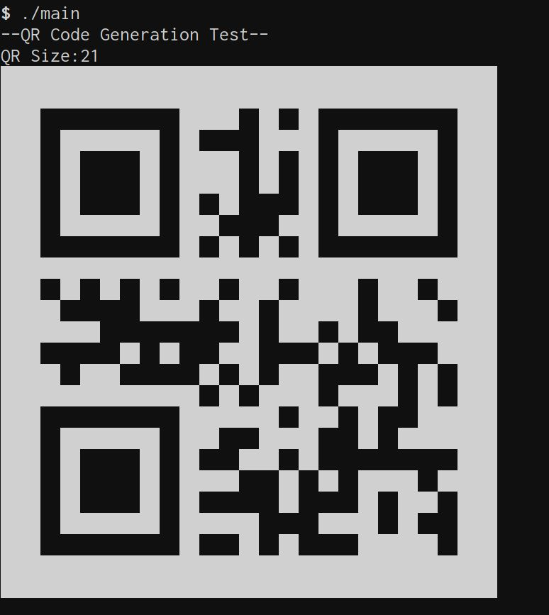

# Test Implementation of QREncode Usage

(The code way...)

This is a simple ASCII implementation of the QR code generation.

## Requirements

* libqrencode (Or qrencode libraries (headers) need to be installed)

## Screenshot

